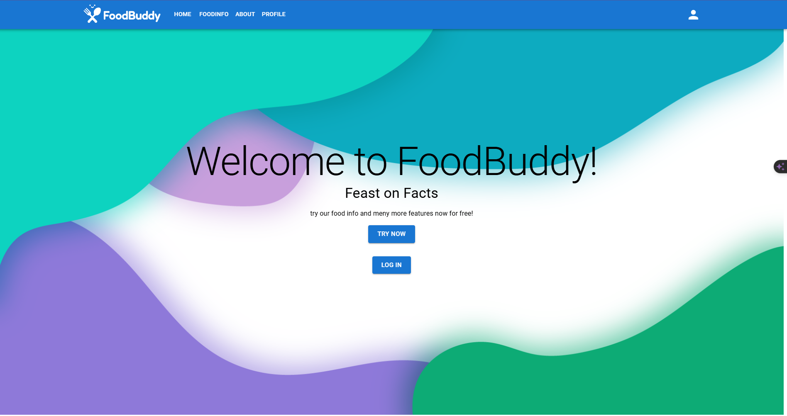
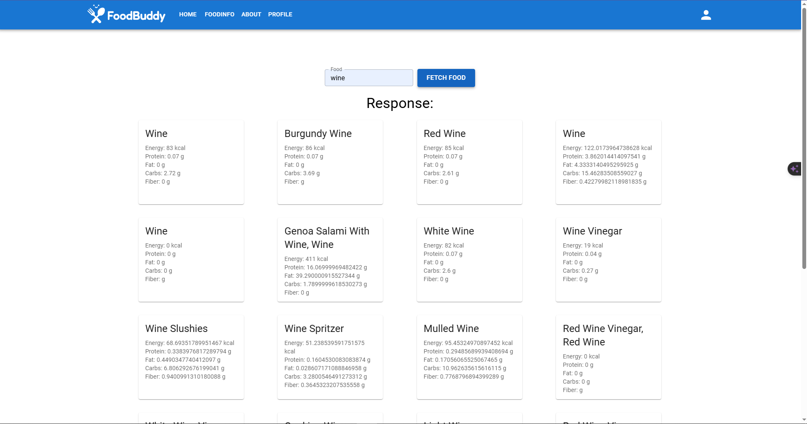
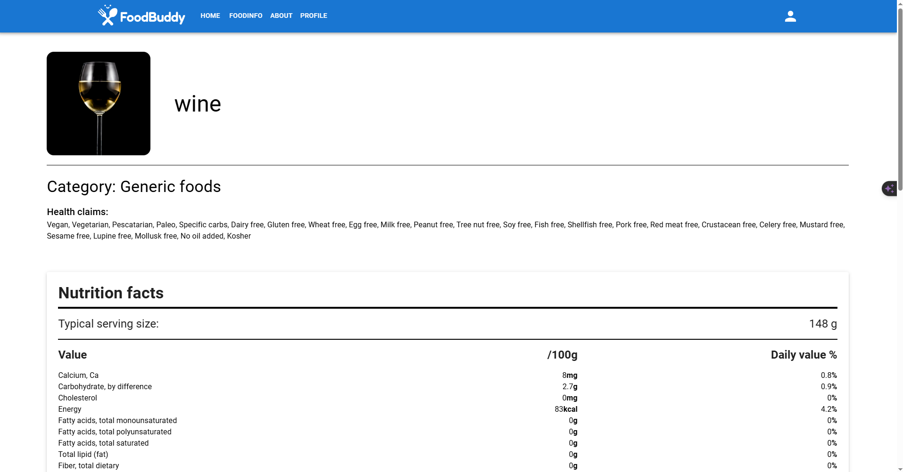
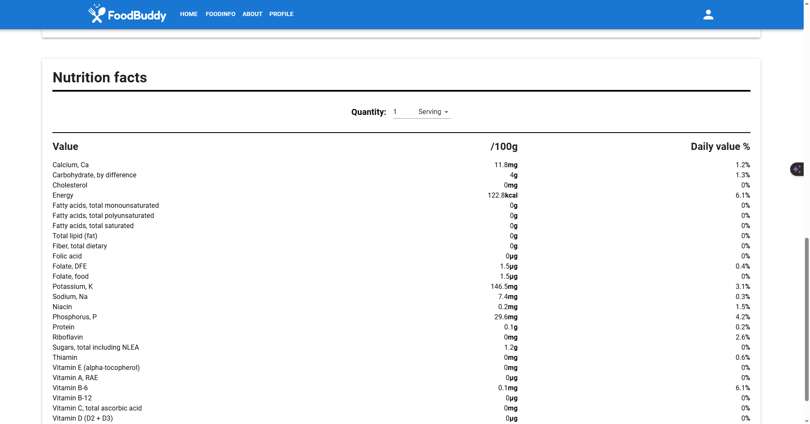

# Robin Wyffels (202079173)

- [x] Front-end Web Development
  - <https://github.com/Web-IV/2324-frontendweb-RobinWyffels/tree/main>
  - <https://foodbuddy-vk5z.onrender.com>

**Logingegevens**

- Zelf te registreren met Auth0
- Gebruikersnaam/e-mailadres: Naar keuze
- Wachtwoord: Naar keuze 

## Projectbeschrijving

## Screenshots






## Behaalde minimumvereisten

### Front-end Web Development

- **componenten**

  - [x] heeft meerdere componenten - dom & slim (naast login/register)
  - [x] applicatie is voldoende complex
  - [x] definieert constanten (variabelen, functies en componenten) buiten de component
  - [x] minstens één form met meerdere velden met validatie (naast login/register)
  - [x] login systeem
<br />

- **routing**

  - [x] heeft minstens 2 pagina's (naast login/register)
  - [x] routes worden afgeschermd met authenticatie en autorisatie
<br />

- **state-management**

  - [x] meerdere API calls (naast login/register)
  - [x] degelijke foutmeldingen indien API-call faalt
  - [x] gebruikt useState enkel voor lokale state
  - [x] gebruikt gepast state management voor globale state - indien van toepassing
<br />

- **hooks**

  - [x] gebruikt de hooks op de juiste manier
<br />

- **varia**

  - [x] een aantal niet-triviale e2e testen
  - [x] minstens één extra technologie
  - [x] maakt gebruik van de laatste ES-features (async/await, object destructuring, spread operator...)
  - [x] duidelijke en volledige README.md
  - [x] volledig en tijdig ingediend dossier en voldoende commits

## Projectstructuur

### Front-end Web Development

De main.jsx is het hooft component, deze laad alle adere children componenten. 
Elke pagina heeft zijn eigen component. wanneer er herhalende code kwam werd dit ook in zijn eigen component gestoken.

## Extra technologie

### Front-end Web Development

alles is gebaseerd op de component library van Mui.com, Material UI. 
```sh
yarn add @mui/material @emotion/react @emotion/styled
```
<https://mui.com/material-ui/getting-started/installation/>

### Wat is er verbeterd/aangepast?

-De login werkt volledig met Auth0 en gegevens worden getoond op de paginas, foodinfo is afgeschermd.
-Elke Component werkt met Styled Components
-Apikeys,... staan in .env files. 
